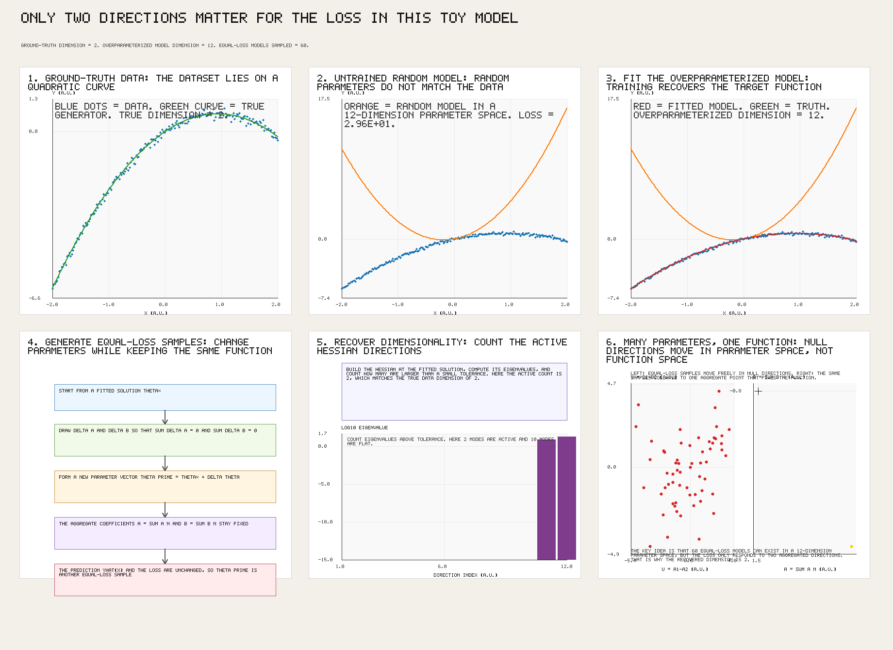
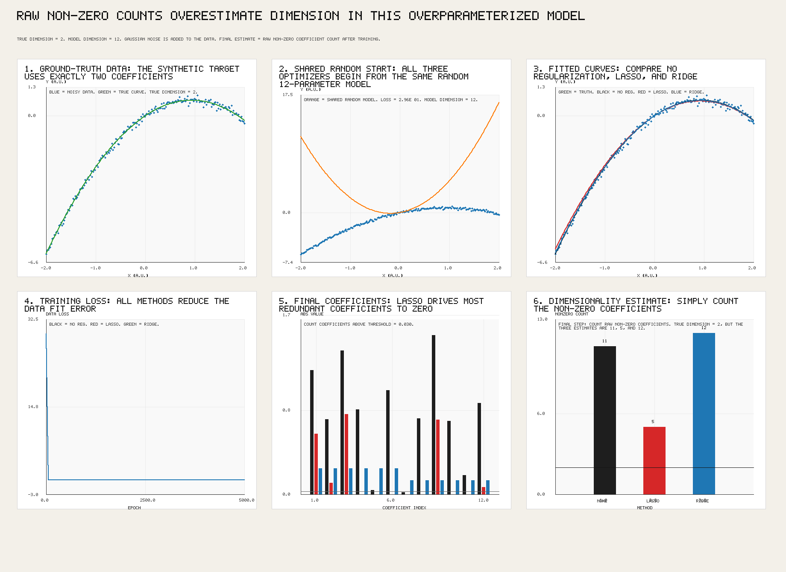

# regression_test

This repository is a simple testbed for studying whether loss-invariant directions in parameter space can reveal the true dimensionality of a dataset.

The core idea is to examine transformations of the model parameters that leave the model output, and therefore the loss, unchanged. Locally, these directions are approximated by the null space of the Hessian. Globally, they correspond to symmetries of the model.

Finally, we will compare this to regularization methods Ridge and Lasso, which function by penalizing the magnitude of coefficients. While these methods do constrain the coefficients found, they do not point to a clean way of recovering the true dimensionality of the underlying data. 

## Method

We construct a 2 dimensional dataset of the form

$$
y = m_1 x + m_2 x^2
$$

and fit it with an overparameterized model of the form. 

$$
y = \sum_{n} \left(a_n x + b_n x^2\right)
$$

In the default experiment `n = 6`, so the model has `12` parameters and the script samples `60` equal-loss models.

Both experiments add a small amount of Gaussian noise to the synthetic dataset.

We then study the set of parameter values that preserve the same loss and test whether that structure can be used to recover the true dimensionality of the data, which in this example is 2.

## Results

Here are the results from the loss_invariance experiment:

Here are the results from the lasso and ridge experiment:

